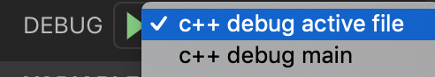

# Programming Assignment 3: Self-Balancing Binary Search Trees (BSTs)
In this Programming Assignment, you will be assessing your understanding of three types of self-balancing Binary Search Trees (BSTs): Randomized Search Trees (RSTs), AVL Trees, and Red-Black Trees.

## Representing Graphs as Edge Lists
For multiple parts of this assignment, you will need to provide examples of trees as the solution. One way of representing any arbitrary [graph](https://en.wikipedia.org/wiki/Graph_(abstract_data_type)), including a tree, is as an [edge list](https://en.wikipedia.org/wiki/Edge_list). In this assignment, you will represent edge lists as plain-text files where each line of the file represents an edge between nodes ``u`` and ``v`` in the format ``u -> v``.

For example, we can represent the following BST:


In the following plain-text edge list:

```
42 -> 10
42 -> 50
10 -> 5
10 -> 20
50 -> 45
50 -> 60
```

Note that, in this assignment, we don't care about the order in which you list the edges: any arbitrary order is the same. For example, the following edge list is completely equivalent to the previous:

```
10 -> 5
10 -> 20
42 -> 10
42 -> 50
50 -> 45
50 -> 60
```

## Part 0: Setup

Work through the [SETUP.md](SETUP.md) document to configure your development environment. Please note you'll need CMake installed for this PA.

> ### 🛠 Know Your Tools - CMake
> In larger professional C++ projects you'll often find that the [CMake](https://cmake.org/) build configuration tool is used. CMake allows the developer to configure a build with much more flexibility than a Makefile. Based on your current CMake build configuration, CMake will generate a Makefile for you. Make can then build your program based on that Makefile.
>
> To compile our program with CMake we have to first create a build `directory`. Run the following command in your project's root directory:
> ```
> rm -rf build && mkdir build && cd build
> ```
> Now while you're in the `build` directory you can run:
> ```
> cmake ..
> ```
> If you now run `ls` in the build directory, you can see that a Makefile was generated there. This means we can now run `make` inside the build directory and it will compile our program.
>
> One nice thing about having a `build` directory is that we know for sure that all the automatically generated files will end up in this directory. That makes it really easy to for example gitignore all those generated files.
>
> CMake's configureable nature means you can easily switch from for example a debug build to a production build. From your project's root directory run:
> ```
> cmake -DCMAKE_BUILD_TYPE=Debug build
> make -C build
> ```
> (note that the `-C build` option will tell `make` to first go into the `build` directory before trying to build any targets. If your terminal's working directory is already set to the `build` directory, then you can just run `make` without the `-C build` option.)
>
> Now you can run gdb on the executables produced by make.
>
> CMake also supports build systems other than GNU Make. A newer build system that has gained popularity recently is called [Ninja](https://ninja-build.org/).
> You can generate a `build.ninja` file by running the folowing commands from your project's root directory:
> ```
> cmake -DCMAKE_GENERATOR="Ninja" build
> ninja -C build
> ```
>
> And switch back to Makefiles by running:
> ```
> cmake -DCMAKE_GENERATOR="Unix Makefiles" build
> make -C build
> ```
>
> Unless you want to make a change to your CMake configuration you'll usually only have to run `cmake` once. After that, running `make` should suffice for compiling the latest version of your source code.

### Task: Read the CMakeLists.txt file
Read the CMakeLists.txt file and try to understand what each line does.
"Include directories" are directories where your build target's header files are located.
You can find a basic CMake introduction [here](https://cliutils.gitlab.io/modern-cmake/chapters/basics.html).

### Task: Add a VSCode Debugger Configuration (Optional)
VSCode has a debugger that allows you to set breakpoints by clicking next to the line numbers and lets you step through your code using the GUI.
In previous PAs this debugger was already preconfigured for you, but this PA you'll have to configure it for yourself. We'll explain the configuration process below, also feel free to refer to the previous PAs for guidance on how to configure a debugger in this PA.

VSCode documentation on C++ debugging can be found [here](https://code.visualstudio.com/docs/cpp/cpp-debug).

The [launch configuration](https://code.visualstudio.com/docs/editor/debugging#_launch-configurations) for your debugger belongs in the following file `.vscode/launch.json`.

This is PA1's configuration:

```json
{
    "version": "0.2.0",
    "configurations": [
        {
            "name": "active file",
            "type": "cppdbg",
            "request": "launch",
            "program": "${workspaceFolder}/${fileBasenameNoExtension}",
            "args": [],
            "stopAtEntry": false,
            "cwd": "${workspaceFolder}",
            "environment": [],
            "externalConsole": false,
            "MIMode": "gdb",
            "setupCommands": [
                {
                    "description": "Enable pretty-printing for gdb",
                    "text": "-enable-pretty-printing",
                    "ignoreFailures": true
                }
            ],
            "preLaunchTask": "build active file",
            "miDebuggerPath": "/usr/bin/gdb"
        }
    ]
}
```

The `"name"` is how your configuration will show up under the debug window:


You can open the debug window using the large menu buttons on the left of the VSCode window.

Since this build configuration used `make` and we're now using `cmake`, you'll have to make some changes.

First, the compiled program can no longer be found at the path listed under `"program"` because it is now generated under the build directory. So you'll have to update that path.

If you're wondering what `${workspaceFolder}` means, it is a variable defined by VSCode. You can find all available variables [here](https://code.visualstudio.com/docs/editor/variables-reference).

Another thing you'll have to change is the `"preLaunchTask"`.
Tasks are defined in `.vscode/tasks.json`. This is PA's tasks.json:

```json
{
    "tasks": [
        {
            "type": "shell",
            "label": "build active file",
            "command": "make ${fileBasenameNoExtension}"
        }
    ],
    "version": "2.0.0"
}
```

As you see the `"label"` of the task is equal to the `"preLaunchTask"` defined the debug configuration in launch.json. This is how VSCode determines it should run the command defined in this task.

The `"command"` defined in this task only uses `make`. You'll have to update it to also use `cmake`. Moreover, you'll have to make sure `cmake` is configured to build your program in debug mode. The `&&` shell operator may come in handy.

## Part 1: AVL Rotations (25 points)
In order to rebalance the tree after an insertion, self-balancing BSTs can make use of [AVL Rotations](https://www.youtube.com/watch?v=xzmLuS0ZJmA&list=PLM_KIlU0WoXmkV4QB1Dg8PtJaHTdWHwRS&index=34), which allow us to restructure the tree without breaking the BST properties.

### Task 1a: Create ``1a.txt`` (5 points)
Imagine we have the following BST:


Its edge list is the following:

```
10 -> 20
20 -> 30
```

Create a file called ``1a.txt`` (case-sensitive) in the root directory of this repository (i.e., in the same folder as [``README.md``](README.md)) containing the edge list of the tree resulting from doing a **left AVL rotation** on nodes 10 and 20.

### Task 1b: Create ``1b.txt`` (5 points)
Imagine we have the following BST:


Its edge list is the following:

```
30 -> 20
30 -> 35
20 -> 10
20 -> 25
```

Create a file called ``1b.txt``  (case-sensitive) in the root directory of this repository (i.e., in the same folder as [``README.md``](README.md)) containing the edge list of the tree resulting from doing a **right AVL rotation** on nodes 30 and 20.

### Task 1c: Create ``1c.txt`` (5 points)
Imagine we have the following BST:


Its edge list is the following:

```
30 -> 20
30 -> 35
20 -> 10
20 -> 25
```

Create a file called ``1c.txt``  (case-sensitive) in the root directory of this repository (i.e., in the same folder as [``README.md``](README.md)) containing the edge list of the tree resulting from doing a **left AVL rotation** on nodes 20 and 25.

### Task 1d: Create ``1d.txt`` (5 points)
Imagine we have the following BST:


Its edge list is the following:

```
30 -> 20
30 -> 40
20 -> 10
20 -> 25
40 -> 35
40 -> 45
```

Create a file called ``1d.txt``  (case-sensitive) in the root directory of this repository (i.e., in the same folder as [``README.md``](README.md)) containing the edge list of the tree resulting from doing a **left AVL rotation** on nodes 40 and 45.

### Task 1e: Create ``1e.txt`` (5 points)
Imagine we have the following BST:


Its edge list is the following:

```
30 -> 20
30 -> 40
20 -> 10
20 -> 25
40 -> 35
40 -> 45
```

Create a file called ``1e.txt``  (case-sensitive) in the root directory of this repository (i.e., in the same folder as [``README.md``](README.md)) containing the edge list of the tree resulting from doing a **left AVL rotation** on nodes 30 and 40.

## Part 2: Treaps and Randomized Search Trees (RSTs) (20 points)
We first introduced the [Treap](https://en.wikipedia.org/wiki/Treap), which is a mixture of a [Binary Search Tree (BST)](https://en.wikipedia.org/wiki/Binary_search_tree) and a [Heap](https://en.wikipedia.org/wiki/Heap_(data_structure)). Specifically, a Treap contains ``(key,priority)`` tuples, and it maintains the BST properties with respect to its keys as well as the Heap property with respect to its priorities. We then introduced the [Randomized Search Tree (RST)](https://en.wikipedia.org/wiki/Random_binary_tree#Treaps_and_randomized_binary_search_trees), which is a Treap that is given the keys to insert, but that randomly generates the priority of each key.

### Task 2a: Create ``2a.txt`` (4 points)
Imagine we have the following RST, where nodes are ``(key,priority)`` tuples:


Its edge list is the following:

```
(I,42) -> (E,21)
(I,42) -> (M,40)
(E,21) -> (A,10)
(M,40) -> (N,30)
```

Create a file called ``2a.txt`` (case-sensitive) in the root directory of this repository (i.e., in the same folder as [``README.md``](README.md)) containing the edge list of the RST resulting from inserting ``(G,11)``.

### Task 2b: Create ``2b.txt`` (4 points)
Imagine we have the following RST, where nodes are ``(key,priority)`` tuples:


Its edge list is the following:

```
(I,42) -> (E,21)
(I,42) -> (M,40)
(E,21) -> (A,10)
(M,40) -> (N,30)
```

Create a file called ``2b.txt`` (case-sensitive) in the root directory of this repository (i.e., in the same folder as [``README.md``](README.md)) containing the edge list of the RST resulting from inserting ``(K,41)``.

### Task 2c: Create ``2c.txt`` (4 points)
Imagine we have the following RST, where nodes are ``(key,priority)`` tuples:


Its edge list is the following:

```
(I,42) -> (E,21)
(I,42) -> (M,40)
(E,21) -> (A,10)
(M,40) -> (N,30)
```

Create a file called ``2c.txt`` (case-sensitive) in the root directory of this repository (i.e., in the same folder as [``README.md``](README.md)) containing the edge list of the RST resulting from inserting ``(X,41)``.

### Task 2d: Create ``2d.txt`` (4 points)
Imagine we have the following RST, where nodes are ``(key,priority)`` tuples:


Its edge list is the following:

```
(I,42) -> (E,21)
(I,42) -> (M,40)
(E,21) -> (C,10)
(M,40) -> (L,20)
(M,40) -> (N,30)
```

Create a file called ``2d.txt`` (case-sensitive) in the root directory of this repository (i.e., in the same folder as [``README.md``](README.md)) containing a single ``(key,priority)`` tuple that, when inserted into this RST, will make the RST **perfectly balanced** and **will not cause any AVL rotations** during the insertion.

### Task 2e: Create ``2e.txt`` (4 points)
Imagine we have the following RST, where nodes are ``(key,priority)`` tuples:


Its edge list is the following:

```
(I,42) -> (E,21)
(I,42) -> (M,40)
(E,21) -> (C,10)
(M,40) -> (L,20)
(M,40) -> (N,30)
```

Create a file called ``2e.txt`` (case-sensitive) in the root directory of this repository (i.e., in the same folder as [``README.md``](README.md)) containing a single ``(key,priority)`` tuple that, when inserted into this RST, will make the RST **perfectly balanced** and will cause **exactly 2 AVL rotations** during the insertion.

## Part 3: AVL Trees (25 points)
We then introduced the [AVL Tree](https://en.wikipedia.org/wiki/AVL_tree), which is another self-balancing BST but with strict bounds on the "balance factor" (right height minus left height) of every node.

### Task: Edit [``BinaryTree.cpp``](BinaryTree.cpp) (25 points)
In this repository, there is a file called [``BinaryTree.cpp``](BinaryTree.cpp) that contains a basic implementation of a binary tree. Function headers (with usage details) are included in [``BinaryTree.h``](BinaryTree.h), and you need to fill in the ``balanceFactors()`` function of the ``BinaryTree`` class. We will not be checking for memory leaks, as we will be creating the dynamic objects, not you.

We have provided a tester program, [``BinaryTreeTest``](BinaryTreeTest.cpp), that will help you test your code. You can compile it using cmake as explained above.

When run from the command line, it will print every node's balance factor to standard output, and it will print the tree (in the [Newick format](https://en.wikipedia.org/wiki/Newick_format)) to standard error. You can run the tester program and direct the balance factors to a file called ``balance_factors.tsv`` and the tree to a file called ``tree.nwk`` as follows:

```
$ make -C build
$ ./build/BinaryTreeTest > balance_factors.tsv 2> tree.nwk
```

You can then open ``balance_factors.tsv`` in any text editor or spreadsheet viewer, and you can open ``tree.nwk`` in a tree viewing tool like [IcyTree](https://icytree.org/). To use IcyTree, you can do the following:

1. Load the tree (File → Load from file... → select your tree file)
2. By default, it [ladderizes](http://blog.phytools.org/2014/09/new-function-to-ladderize-tree-with.html) the tree, which we don't want because we need to check balance factors, so "left" and "right" have meaning in our context. We need to disable it (Style → Node sorting → Unsorted)
3. By default, it only displays leaf labels, so show internal nodes too (Style → Internal node text → Label)

### Task: Make CMake aware that TestBinaryTree is a test (5 points)
CMake is bundled with a tool called [CTest](https://cmake.org/cmake/help/latest/manual/ctest.1.html) which can be used to run unit tests.
In order for CTest to recognize TestBinaryTree is a test we'll need to register the TestBinaryTree executable as a test in our [CMakeLists.txt](CMakeLists.txt) file.

⚠️ Be sure to call your test `test_BinaryTreeTest`!

[This documentation page](https://cmake.org/cmake/help/latest/command/add_test.html) may be helpful.

After compiling with `make -C build` you can run your test in the following 2 ways:

1. Run `make -C build test`
2. Run `ctest` inside your build directory

You should see the following output:
```
[root@36a775ab3908 cse100]# make -C build test
make: Entering directory '/Code/cse100/build'
Running tests...
Test project /Code/cse100/build
    Start 1: test_BinaryTreeTest
1/1 Test #1: test_BinaryTreeTest ..............   Passed    0.02 sec

100% tests passed, 0 tests failed out of 1

Total Test time (real) =   0.06 sec
make: Leaving directory '/Code/cse100/build'
```

> ### 🛠 Know Your Tools - CTest
> [CTest](https://cmake.org/cmake/help/latest/manual/ctest.1.html) is a tool bundled with CMake which can be used to run unit tests.
> Any executable command can be registered as a test.
> For example you could add the following test `add_test(test_dummy bash -c "exit 1")` to your CMakeLists.txt file.
> This means `test_dummy` will run the command `bash -c "exit 1"` and because this command returns exit code 1, CTest will report `test_dummy` failed. If you change "exit 1" to "exit 0" and run `make` again then `test_dummy` will pass when you run CTest.
> 
> Note that this also means that test_BinaryTreeTest in its original form in the starter code is not a very good CTest as it does not make any assertions and always exits with code 0 (unless an exception occurs). So this means that it will only help us catch potential exceptions, not potential correctness bugs. If you want your test to also catch correctness bugs you'll have to make some assertions about the balance factors in the pairs in the `unordered_map` and `return 1` if the assertion fails.

## Part 4: Red-Black Trees (25 points)
The last self-balancing BST we discussed is the [Red-Black Tree](https://en.wikipedia.org/wiki/Red%E2%80%93black_tree). The Red-Black Tree is less strict with regard to balance than is the AVL Tree, but the Red-Black Tree is still guaranteed to be O(log *n*) in height.

### Task 4a: Create ``4a.txt`` (5 points)
Imagine we have the following Red-Black Tree:


Its edge list is the following:

```
30 -> 15
30 -> 70
15 -> 10
15 -> 20
```

Create a file called ``4a.txt`` (case-sensitive) in the root directory of this repository (i.e., in the same folder as [``README.md``](README.md)) containing a single integer that, when inserted into this Red-Black Tree, will result in exactly **2 red nodes** after the insertion is complete.

### Task 4b: Create ``4b.txt`` (5 points)
Imagine we have the following Red-Black Tree:


Its edge list is the following:

```
30 -> 15
30 -> 70
15 -> 10
15 -> 20
```

Create a file called ``4b.txt`` (case-sensitive) in the root directory of this repository (i.e., in the same folder as [``README.md``](README.md)) containing a single integer that, when inserted into this Red-Black Tree, will result in exactly **3 red nodes** after the insertion is complete.

### Task 4c: Create ``4c.txt`` (5 points)
Imagine we have the following Red-Black Tree:


Its edge list is the following:

```
30 -> 15
30 -> 70
70 -> 60
70 -> 80
80 -> 90
```

Create a file called ``4c.txt`` (case-sensitive) in the root directory of this repository (i.e., in the same folder as [``README.md``](README.md)) containing a single integer that, when inserted into this Red-Black Tree, **will not cause any AVL rotations** during the insertion.

### Task 4d: Create ``4d.txt`` (5 points)
Imagine we have the following Red-Black Tree:


Its edge list is the following:

```
30 -> 15
30 -> 70
70 -> 60
70 -> 80
80 -> 90
```

Create a file called ``4d.txt`` (case-sensitive) in the root directory of this repository (i.e., in the same folder as [``README.md``](README.md)) containing a single integer that, when inserted into this Red-Black Tree, will cause a **single rotation** during the insertion.

### Task 4e: Create ``4e.txt`` (5 points)
Imagine we have the following Red-Black Tree:


Its edge list is the following:

```
30 -> 15
30 -> 70
70 -> 60
70 -> 80
80 -> 90
```

Create a file called ``4e.txt`` (case-sensitive) in the root directory of this repository (i.e., in the same folder as [``README.md``](README.md)) containing a single integer that, when inserted into this Red-Black Tree, will cause a **double rotation** during the insertion.

## Academic Integrity
This Programming Assignment (PA) must be completed 100% independently! You may only discuss the PA with the Tutors, TAs, and Instructors. You are free to use resources from the internet, but you are not allowed to blatantly copy-and-paste code. If you ever find yourself highlighting a code snippet, copying, and pasting into your PA, you are likely violating the Academic Integrity Policy. If you have any concerns or doubts regarding what you are about to do, *please* be sure to post on Piazza first to ask us if it is okay.

## Grading (100 points total)
* **Part 1: AVL Rotations**
    * 5 points for a correct ``1a.txt`` (0 points for incorrect)
    * 5 points for a correct ``1b.txt`` (0 points for incorrect)
    * 5 points for a correct ``1c.txt`` (0 points for incorrect)
    * 5 points for a correct ``1d.txt`` (0 points for incorrect)
    * 5 points for a correct ``1e.txt`` (0 points for incorrect)
* **Part 2: Treaps and Randomized Search Trees (RSTs)**
    * 4 points for a correct ``2a.txt`` (0 points for incorrect)
    * 4 points for a correct ``2b.txt`` (0 points for incorrect)
    * 4 points for a correct ``2c.txt`` (0 points for incorrect)
    * 4 points for a correct ``2d.txt`` (0 points for incorrect)
    * 4 points for a correct ``2e.txt`` (0 points for incorrect)
* **Part 3: AVL Trees**
    * 20 points for a completely correct solution (partial credit for the proportion of nodes that were correct)
    * 5 points for registering `TestBinaryTree` as a CTest test
* **Part 4: Red-Black Trees**
    * 5 points for a correct ``4a.txt`` (0 points for incorrect)
    * 5 points for a correct ``4b.txt`` (0 points for incorrect)
    * 5 points for a correct ``4c.txt`` (0 points for incorrect)
    * 5 points for a correct ``4d.txt`` (0 points for incorrect)
    * 5 points for a correct ``4e.txt`` (0 points for incorrect)
* **Know Your Tools**
    * up to 5 points for the Know Your Tools assignment on gradescope

## Submission
* Run `./create_submission_zip.sh` in your project root.
* Submit `submission.zip` to the programming assignment auto grader on [Gradescope](https://www.gradescope.com/)
* Submit the Know Your Tools assignment on [Gradescope](https://www.gradescope.com/)
* Late submissions **will not be accepted**, check [Gradescope](https://www.gradescope.com/) for the deadlines.
